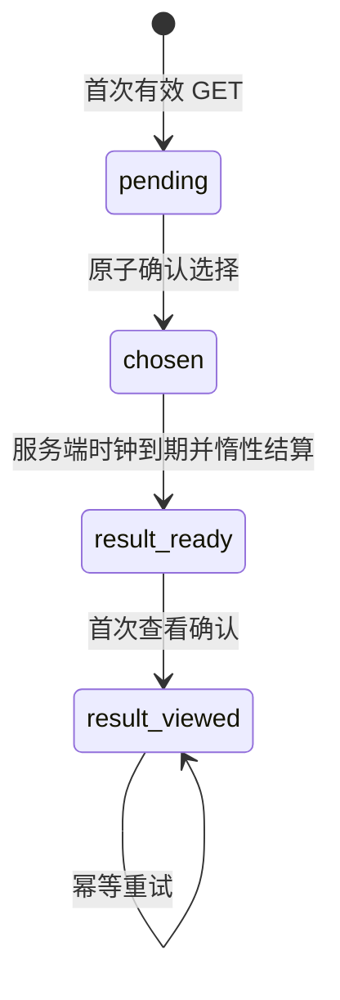

# Living Loop P0 产品与技术合同

- 版本：1.0
- 日期：2026-08-28
- 状态：实现与验收基线
- 实验键：`living_loop_p0`
- 首个场景：`harbor_wage_dispute_v1`，版本 `1`
- 开发分支：`product/living-loop-p0-20260828`
- 目标分支：`challenge/webmcp-civic-copilot`

本文是 Living Loop P0 的仓库内规范。实现、测试、迁移、管理指标和上线手册都必须与本文一致。产品事件的逐事件白名单见 [LIVING_LOOP_P0_EVENT_TAXONOMY.md](LIVING_LOOP_P0_EVENT_TAXONOMY.md)。

## 1. 目标和边界

P0 建立一条真实、持久、可回访验证的闭环：

```text
回访 → 自你离开后 → 今天最重要的一件事 → 三选一 → 立即影响
     → 等待 → 再次回访 → 查看延迟后果 → 留下可追溯记录
```

核心文案是：

> 你离开后，小镇仍在生活；你回来后，每个选择都会留下痕迹。

P0 只回答一个产品问题：用户是否愿意为了自己此前选择产生的后果，再次回到 Simverse World？它不是地图扩建、经济改版或 WebMCP 扩展项目。

### 1.1 范围内

- 新增受保护路由 `/today`，并保留 `/play` 为永久地图入口。
- 聚合玩家居民、上一次 Living Loop 结果、最多两条 Notification 和最新 Digest。
- 提供一个版本化、确定性、持久化的三选一决策。
- 保存立即结果和延迟结果快照，按服务端时间惰性结算。
- 建立隐私受限的第一方产品事件账本和只读管理漏斗。
- 用默认关闭的前后端功能开关隔离新行为。

### 1.2 明确非目标

P0 不做以下事项：

- 多小镇、扩地图或大规模 Phaser/GamePage 重构。
- 居民健康、年龄、退休、迁入迁出、继承、真人街区或导师系统。
- 三十天赛季、创作者市场、分成、会员或真实货币。
- Push、短信或邮件通知。
- LLM 自动生成事件；Living Loop 请求链路不得调用 LLM。
- 修改 Soul Coin、既有经济、关系图谱、市政投票、市场、Challenge 会话或全局城市状态。
- 新增 WebMCP 写工具，或修改 Challenge surface manager、工具合同和 `/challenge` 生命周期。
- 把 Living Loop 结果写入现有 Capsule、Notification 或 Digest 表。
- 生产部署、Cloudflare/VM/生产 `.env` 变更、Devpost 操作或 PR 合并。

“城市档案”在 P0 中指 `living_loop_days` 内不可变的场景、选择和结果快照，以及 `/today` 对最近结果的可追溯呈现；P0 不新增独立档案系统。

## 2. 功能开关与路由合同

### 2.1 配置

| 端 | 环境变量 | 默认值 | 合法范围/语义 |
|---|---|---:|---|
| 后端 | `LIVING_LOOP_P0_ENABLED` | `false` | 关闭时用户 API 不创建或修改 P0 数据 |
| 后端 | `LIVING_LOOP_P0_DELAY_SECONDS` | `28800` | `60..604800` 秒；默认 8 小时；测试通过注入时钟，不用真实等待 |
| 前端 | `VITE_LIVING_LOOP_P0_ENABLED` | `false` | 仅控制入口、路由和页面呈现，不能替代后端授权 |

后端开关是数据写入的最终闸门。前端开关开启但后端关闭时，页面必须显示友好降级并提供 `/play`；不得重试循环、白屏或偷偷创建记录。

### 2.2 路由矩阵

| 条件 | 访问 `/` | 直接访问 `/today` |
|---|---|---|
| 未登录 | 现有 LandingPage | `/login?next=%2Ftoday` |
| 已登录、onboarding 未完成 | `/onboarding` | `/onboarding?next=%2Ftoday` |
| 已登录、前端开关关闭 | 现有 GamePage 行为 | feature-disabled 状态，可进入 `/play` |
| 已登录、前端开关开启、onboarding 完成 | 进入或重定向 `/today` | TodayPage |
| 前端开启、后端关闭或 API 不可用 | `/today` 降级页 | `/today` 降级页，可重试或进入 `/play` |

`/play` 永远渲染现有地图。`/challenge`、`/town`、`/watch` 及其前进、后退、刷新和 WebMCP 生命周期不受上述开关影响。onboarding 检查失败时沿用现有 fail-open 原则，进入 `/play`，不把用户困在循环跳转中。

## 3. `/today` 用户体验合同

页面移动端优先，首屏在不滚动或少量滚动时必须回答：离开后发生了什么、今天要处理什么、何时能看到后果。

### 3.0 未登录首页

LandingPage 保留现有视觉体系、公开小镇入口，以及世界、居民、记忆和 Forge 等既有介绍，不做整站重写。首屏副标题改为核心文案；主 CTA 使用“看看今天发生了什么”并进入保留 `/today` return path 的登录流程；次 CTA 使用“观看小镇实况”并继续指向 `/town`。Forge 只降低首屏优先级，不删除功能或介绍。

### 3.1 固定信息层级

1. 顶部：UTC 对应的展示日期、玩家居民头像/姓名和“进入小镇”。
2. “自你离开以后”：最近一个 Living Loop 延迟结果（如有）、最多两条未读优先的最新 Notification、最新有效村落 Digest 摘要。读取 Notification 不得写 `read_at`。
3. “今天最重要的一件事”：场景、风险、三个选项、明确取舍、二次确认、立即结果和延迟结果状态。
4. “城市脉搏”：最新有效村落 Digest；没有日报或读取失败时显示固定、非 LLM 兜底内容。
5. 次要入口：`/play`、`/profile`；Forge、市场、市政厅和关系图谱不得重新堆进首屏。

次要聚合源失败必须 fail-open：Notification 或 Digest 任一失败时，主决策仍可读取和提交。不得因聚合失败调用 LLM 补写内容。

### 3.2 必须呈现的状态

- `loading`：骨架或稳定加载状态。
- `error/retry`：可重试，同时始终可进入 `/play`。
- `feature_disabled`：解释功能尚未开启，不产生 P0 写入。
- `setup_required`：缺少玩家居民时指向 onboarding，不创建当日决策。
- `pending`：三个选项均可审阅和键盘选择。
- `confirmation`：显示所选项及取舍；确认前不得调用选择 API。
- `immediate_result`：确认成功后显示服务端返回的立即影响。
- `waiting`：仅显示服务端 `result_available_at` 的可查看时间/剩余时间。
- `result_ready`：显示服务端返回的延迟正文，并触发幂等的 result-viewed 确认。
- `result_viewed`：保持延迟正文和历史状态，刷新后不倒退。

倒计时只说明后果可查看时间，不制造稀缺性，不使用签到中断、威胁或居民责备来制造焦虑。

### 3.3 可访问性

- 所有选项、确认、重试和导航可仅用键盘完成，并有可见焦点。
- 单选组、状态变化、倒计时和确认区域具有正确语义与 ARIA 标签。
- 提交成功后焦点移至立即结果；延迟结果出现后焦点移至结果标题，避免重复播报。
- `prefers-reduced-motion` 下关闭非必要动画。
- 320px 宽度起不得产生页面级横向滚动；文本和数值不依赖颜色单独传达。
- 不使用 `dangerouslySetInnerHTML` 渲染后端文本。

## 4. 确定性场景注册表

注册表由后端版本化代码定义。客户端只提交 `choice_key`，不得提交影响值、结果正文、场景版本或可查看时间。

### 4.1 场景 v1

- `scenario_key`: `harbor_wage_dispute_v1`
- `scenario_version`: `1`
- 标题：`港口欠薪风波`
- 背景模板：`{player_resident_name} 在港口发现三名工人连续两周没有拿到完整工资。港口不能停摆，但工人的耐心也接近极限。你需要决定今天先做什么。`
- 核心风险：`港口不能停摆`、`工人耐心接近极限`

| `choice_key` | 标签 | 立即影响 | 明示风险 | 延迟后果 |
|---|---|---|---|---|
| `public_support` | 公开站出来支持工人 | 工人信任 `+8`；管理方信任 `-5`；城市信用 `+2` | 公开对立可能让谈判更困难 | 工人代表同意出席谈判，但管理方暂时限制了部分港口访问权限 |
| `private_mediation` | 先组织一场私下调解 | 工人信任 `+3`；管理方信任 `+3`；城市信用 `+1` | 双方都可能把调解视为拖延 | 双方同意建立临时发薪时间表，但历史欠款仍未解决 |
| `collect_evidence` | 先核实排班和欠薪证据 | 工人信任 `+2`；管理方信任 `0`；城市信用 `+4` | 短期内工人仍得不到补偿 | 核查发现账本与实际排班不符，下一阶段获得“完整审计证据”记录 |

这些数值是 Living Loop 独立快照中的产品叙事影响，不代表已修改全局关系或经济。UI 必须明确说明事件已真实保存，但不得暗示 Soul Coin、全局关系或城市财政已经改变。

### 4.2 快照规则

- 首次创建当日记录时保存完整 `scenario_snapshot_json`，包括标题、背景、风险和三个选项的可见文案。
- 选择时从同一注册表版本生成并保存 `immediate_result_json`、`delayed_result_json`。
- 历史读取只使用数据库快照；未来注册表修改不得改写已有记录。
- 缺失的注册表版本是服务端配置错误，必须失败且不写选择，不能回退到另一版本。

## 5. 持久化合同

所有日期和时间使用 UTC；数据库是唯一事实源。

### 5.1 `living_loop_days`

| 字段 | 合同 |
|---|---|
| `id` | UUID 字符串主键 |
| `user_id` | 索引；只从认证上下文派生 |
| `experiment_key` | `living_loop_p0` |
| `day_key` | UTC 日历日 |
| `scenario_key` | `harbor_wage_dispute_v1` |
| `scenario_version` | `1` |
| `state` | `pending \| chosen \| result_ready \| result_viewed` |
| `scenario_snapshot_json` | 创建时的完整可见场景快照 |
| `choice_key` | 未选择时 `null`，选择后不可变 |
| `choice_idempotency_key` | 未选择时 `null`；首次选择的全局唯一 UUID4 长期绑定，不随产品事件清理删除 |
| `immediate_result_json` | 未选择时空对象或 `null`；选择后不可变 |
| `delayed_result_json` | 未选择时空对象或 `null`；选择后保存，但到期前绝不出现在 API 响应中 |
| `first_viewed_at` | 首次成功读取可用 `/today` 的服务端时间 |
| `choice_confirmed_at` | 首次确认的服务端时间 |
| `result_available_at` | `choice_confirmed_at +` 经校验的 delay |
| `result_settled_at` | 首次惰性结算时间 |
| `result_viewed_at` | 首次确认用户已看到延迟结果的时间 |
| `created_at`, `updated_at` | UTC 服务端时间 |

硬约束：

- `UNIQUE(user_id, experiment_key, day_key)`。
- 非空 `choice_idempotency_key` 全局唯一，且仅允许与非空 `choice_key` 同时存在。
- 状态、场景版本和 choice 只能取注册表允许值。
- 用户、实验、日期、场景、选择和全部结果快照一经进入下一状态不可改写。
- JSON 只保存版本化产品内容，不保存聊天、记忆正文、邮箱、Token 或请求元数据。

### 5.2 `product_events`

| 字段 | 合同 |
|---|---|
| `id` | UUID 字符串主键 |
| `event_id` | UUID，全局唯一；也是重试幂等键 |
| `user_id` | 索引；认证上下文派生，客户端不得提交 |
| `session_id` | 可空、受限的非秘密会话关联键 |
| `event_name` | 索引；严格枚举 |
| `properties_json` | 逐事件固定属性白名单，拒绝额外键和自由文本 |
| `occurred_at` | 服务端接收/权威业务时间 |
| `client_occurred_at` | 可空，仅诊断排序，不参与权威漏斗 |
| `created_at` | UTC 服务端时间 |

事件名、属性、批量行为、保留与清理合同见事件分类文档。

### 5.3 迁移

- 迁移 revision 名称预期为 `069_living_loop_p0`；`down_revision` 必须指向实现时 `alembic heads` 返回的唯一真实 HEAD，不能硬编码旧基线。
- upgrade 只新增上述 P0 表、索引和约束，不修改或回填既有用户、经济、关系或 Challenge 数据。
- downgrade 只删除 P0 新增对象。
- 必须验证 upgrade → downgrade 一级 → upgrade；只有真实 PostgreSQL 执行后才能声称 PostgreSQL 已验证。

## 6. 状态机和披露边界



| 当前状态 | 允许操作 | 写入 | 对客户端可见 |
|---|---|---|---|
| `pending` | GET；合法 choose | `first_viewed_at` 最多一次；choose 原子写选择、两份结果快照和时间 | 场景与选项；无立即/延迟结果 |
| `chosen` | GET；相同选择重试 | 到期后最多一次结算 | 立即结果和 `result_available_at`；延迟正文必须为 `null`/省略 |
| `result_ready` | GET；result-viewed | 首次查看最多一次 | 立即结果、延迟结果和全部可查看时间 |
| `result_viewed` | GET；result-viewed 重试 | 无重复事件或时间覆盖 | 与 ready 相同，并标记已查看 |

关键不变量：

1. 到期判断只使用注入的服务端 UTC 时钟；客户端时间和倒计时均无权改变状态。
2. `delayed_result_json` 可以在选择事务中持久化，但 `now < result_available_at` 时任何 API、错误、日志或产品事件响应都不得返回其正文。
3. 结算是单调、幂等的状态转移；`result_settled_at` 和权威 settled 事件只产生一次。
4. `result_viewed_at` 只写首次值，重试不覆盖；客户端“看见”事件不能替代服务端 first-viewed 事件。
5. 不允许取消、重置或改选；跨 UTC 日创建新记录不改变前一天历史。

## 7. REST API 合同

路径遵循仓库现有无 `/api/v1` 前缀的约定。所有用户 API（包括功能关闭时的 GET）均要求 Bearer 认证；管理员 API 还要求现有管理员权限。认证失败使用现有 `401` 合同。

### 7.1 `GET /living-loop/today`

职责：原子地创建或读取 UTC 当日记录、首次查看打点、惰性结算到期结果，并 fail-open 聚合次要来源。不得调用 LLM。

功能关闭时返回 `200`，且不得写数据库：

```json
{
  "experiment": {"key": "living_loop_p0", "enabled": false},
  "server_now": "2026-08-28T12:00:00Z",
  "status": "feature_disabled",
  "player_resident": null,
  "since_you_left": [],
  "city_pulse": null,
  "decision": null,
  "journey": {"town_path": "/play", "profile_path": "/profile"}
}
```

启用且用户已完成 onboarding 时返回：

```json
{
  "experiment": {"key": "living_loop_p0", "enabled": true},
  "server_now": "2026-08-28T12:00:00Z",
  "status": "ready",
  "player_resident": {
    "id": "resident-uuid",
    "slug": "resident-slug",
    "name": "玩家居民",
    "district": "harbor",
    "sprite_key": "player"
  },
  "since_you_left": [],
  "city_pulse": {
    "title": "今日村落日报",
    "summary": "固定长度摘要",
    "date": "2026-08-28",
    "deep_link": "/capsules",
    "is_fallback": false
  },
  "decision": {
    "id": "decision-uuid",
    "scenario_key": "harbor_wage_dispute_v1",
    "scenario_version": 1,
    "state": "pending",
    "title": "港口欠薪风波",
    "context": "玩家居民在港口发现……",
    "stakes": ["港口不能停摆", "工人耐心接近极限"],
    "choices": [],
    "selected_choice": null,
    "immediate_result": null,
    "result_available_at": null,
    "delayed_result": null
  },
  "journey": {"town_path": "/play", "profile_path": "/profile"}
}
```

`since_you_left` 项只允许固定结构：`id`、`kind`（`previous_result|notification|digest`）、`title`、`summary`、`occurred_at`、`deep_link`。其中 Notification 最多两条，读取不得标已读。缺少绑定居民时返回 `200`、`status=setup_required`、`decision=null`，不创建记录。

### 7.2 `POST /living-loop/decisions/{decision_id}/choose`

请求体只接受：

```json
{
  "choice_key": "private_mediation",
  "idempotency_key": "4a67d265-7917-4c31-82b5-4d741c08ab37"
}
```

`idempotency_key` 必须是规范 UUID4；稳定 UUID5 命名空间只保留给结算和首次查看服务端事件。

成功返回当前权威 decision，包含 `selected_choice`、`immediate_result` 和 `result_available_at`，但 `delayed_result` 仍为 `null`。要求：

- 验证功能开关、所有权、UUID、场景版本和选项白名单。
- 一个事务内锁定 decision，写选择、两份结果快照、时间和 `living_loop_choice_confirmed`。
- 同一用户、decision、choice 与幂等键的精确重试返回同一成功语义，不产生第二个事件。
- 已选后用新键重试同一 choice，可返回当前成功状态，但不得产生任何副作用。
- 已选后请求不同 choice 返回 `409 choice_conflict`，历史不变。
- 同一幂等键绑定到不同 decision、用户或 choice 时返回 `409 idempotency_conflict`，不泄露原绑定主体。
- 非法 choice 或格式错误返回 `422`；他人或不存在的 decision 使用不泄露所有权的 `404`。

### 7.3 `POST /living-loop/decisions/{decision_id}/result-viewed`

请求体为空。服务端重新检查所有权和权威时间。尚未到期返回 `409 result_not_available`，响应不得含延迟正文。到期但尚未结算时，可先执行同一幂等结算步骤，再原子写首次查看。

首次成功写 `result_viewed_at` 和 `living_loop_result_first_viewed`；后续调用返回同一 `200` 状态，不改时间、不重复事件。

### 7.4 `POST /product-events/batch`

严格合同和白名单见事件分类文档。最少要求：认证、最多 20 条、32 KiB 请求体上限、每客户端每分钟 30 个请求、全批验证、`event_id` 幂等、拒绝服务端专属事件。

### 7.5 `GET /admin/product-metrics/living-loop-p0`

仅现有管理员可访问。支持可选 UTC `from`/`to` 查询；默认最近 30 天，最大 90 天。响应只含聚合值：

- 时间窗口和 `generated_at`。
- `/today` 独立访问用户数。
- 看到决策的独立用户数。
- 确认选择的独立用户数和完成率。
- 到期结果数量。
- 查看延迟结果的独立用户数和 48 小时回访率。
- 从 `first_viewed_at` 到 `choice_confirmed_at` 的中位秒数。
- 三个 `choice_key` 的数量与占比。

定义：

- 访问和决策查看来自允许的客户端事件；确认、结算和首次查看来自服务端事件/权威时间。
- 完成率 = 确认选择独立用户 / 看到决策独立用户；分母为 0 时返回 `null`。
- 48 小时回访率只纳入确认已满 48 小时的决策；分子是在 `result_available_at` 之后且 `choice_confirmed_at + 48h` 以内首次查看的决策。分母为 0 时返回 `null`。
- 中位数只使用非负、同一 decision 的权威时间差；无样本时返回 `null`。
- 响应不得含用户 ID、decision ID、session ID、姓名、邮箱、事件正文或单用户明细。

## 8. 幂等、并发和事务硬门

### 8.1 当日创建

两个并发 GET 必须通过数据库唯一约束收敛到同一 `(user_id, experiment_key, day_key)` 行。实现可使用 savepoint/唯一冲突后重查，不能通过进程内锁声称跨进程安全。失败重试不得留下半初始化快照。

### 8.2 选择提交

- PostgreSQL 中使用行锁或等价 CAS，使状态检查和写入位于同一事务。
- 幂等键必须持久化绑定；可由同事务中的唯一 `product_events.event_id` 承担，但必须比较 user、decision 和 choice 的完整绑定。
- 选择行更新与 `living_loop_choice_confirmed` 要么一起提交，要么一起回滚。
- 并发不同 choice 只能有一个成功，另一个得到 `409`；并发相同 choice 最终只存在一组结果快照和一个确认事件。
- 不得因 IntegrityError 对整个共享 session 做会吞掉他人工作或留下错误状态的非局部 rollback。

### 8.3 结算与查看

- 在锁定记录后再次比较服务端时钟与状态。
- `chosen → result_ready`、`result_ready → result_viewed` 都是条件更新；重试只读既有结果。
- 状态时间戳和对应服务端事件同事务提交。
- 事件唯一性与状态机共同防止两个 API 进程重复结算或重复首次查看。

## 9. 隐私、安全和保留

- 用户身份只从认证上下文派生；任何用户 API 都不接受 `user_id`。
- 产品事件不保存聊天、记忆正文、事件正文、姓名、邮箱、Token、Cookie、IP、完整 User-Agent 或任意自由文本。
- `properties_json` 必须按事件名拒绝额外键、错误类型和非枚举值；不能只在前端过滤。
- 日志不得输出 Authorization、事件批量原文或尚未到期的延迟正文。
- 产品事件保留 90 天；清理必须提供 dry-run 和显式 apply 的手动命令。P0 不新增高风险常驻清理任务。
- 管理指标只返回聚合数据，不提供 PII 或事件正文。
- 不新增外部分析 SDK、收费依赖或第三方数据传输。

## 10. 成功门槛

### 10.1 代码完成门

以下条件必须全部满足，才能标记“代码完成”：

1. `/today` 在手机和桌面可用，三大区域和全状态齐全。
2. 三选一、二次确认、持久化、刷新/重新登录/跨设备恢复通过。
3. 重试幂等、改选冲突、跨用户隔离和并发唯一性通过。
4. 立即影响可见；延迟正文到期前不可见，到期后只结算和首次查看一次。
5. 结果进入持久快照并能在后续 `/today` 聚合中追溯。
6. 第一方事件和只读管理员漏斗可用，隐私白名单与 90 天清理合同通过。
7. 默认关闭时 `/`、`/play` 兼容，后端关闭时不写数据且前端安全降级。
8. `/challenge`、`/town`、`/watch` 和 WebMCP 注册/生命周期无回归。
9. 全量后端测试、前端测试、lint、类型检查和构建通过。
10. Alembic upgrade、downgrade 一级、再次 upgrade 通过，不破坏旧数据。
11. 规格、事件分类、runbook、实施报告、环境变量和截图齐全。
12. 未合并、未部署、未修改生产环境。

### 10.2 封闭测试后的产品门

这些指标必须来自真实封闭测试，开发阶段不得伪造：

| 指标 | P0 目标 |
|---|---:|
| `/today` 到确认首个选择的中位时间 | `≤ 5 分钟` |
| 看到决策后完成选择 | `≥ 70%` |
| 选择后 48 小时内回来查看延迟后果 | `≥ 40%` |
| `/today` 聚合接口错误率 | `< 1%` |
| 重大回归 | `0` |

### 10.3 必跑验证与证据

后端自动测试至少覆盖：认证、feature-off 零写入、首次创建、同日/并发唯一性、跨用户隔离、三个选项、非法选项、精确重试、新键同选项零副作用、改选冲突、现有 Soul Coin/关系/Challenge 不变、到期前不披露、到期后单次结算、result-viewed 幂等、Notification/Digest fail-open、事件白名单/体积/速率/幂等、管理员权限和全部漏斗计算。

前端自动测试至少覆盖：`/today` 鉴权与 return path、开关矩阵、后端关闭/失败降级、全部 UI 状态、键盘与 ARIA、二次确认、重复点击保护、刷新恢复、到期前后显示规则、遥测失败不阻断、reduced motion、手机无横向溢出，以及 Challenge diagnostics 仍只注册一个诊断工具。

交付前必须执行并在实施报告中记录精确结果：

```bash
cd backend
python3 -m pytest tests/
alembic heads
alembic upgrade head
alembic downgrade -1
alembic upgrade head

cd ../frontend
npm test -- --run
npm run lint
npx tsc --noEmit
npm run build
```

如果 Docker/PostgreSQL 可用，还必须在真实 PostgreSQL 执行迁移往返；不可用时如实注明，不能用 SQLite 结果声称 PostgreSQL 已验证。实施报告和 Draft PR 还要包含桌面/手机截图、Challenge/Town/Back/Refresh/Forward 回归证据、起止 SHA、迁移 revision、已知限制和回滚步骤。

## 11. 回滚和决策门

紧急回滚顺序：先关闭前端开关恢复旧首页，再关闭后端开关停止新建 P0 记录。历史表保留；只有明确永久废弃 P0 时才 downgrade。关闭开关不得删除历史或改变 `/play`。

封闭测试后：选择率和回访率均达标才进入 P1；选择率高但回访低时先增强后果重要性与回访提示；选择率低时重做信息层级和选择成本；技术错误率高时停止产品扩展，先修一致性和稳定性。
